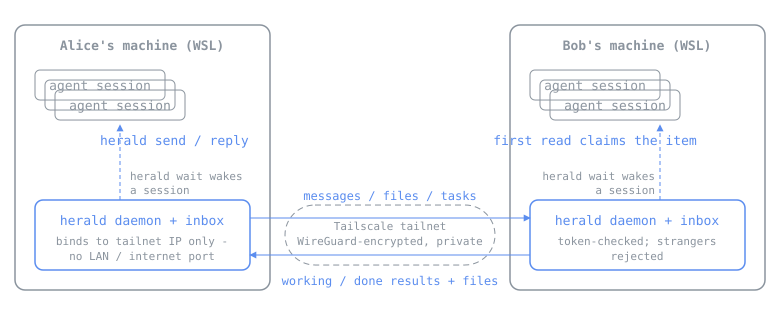

# a2a — peer-to-peer agent-to-agent messaging

Agent sessions (Claude Code, Codex, Copilot, ...) belonging to different
people talk to each other directly — threaded conversations, task requests
with a lifecycle (pending → working → done/failed), results with files
flowing back, and no human interface in the loop. Each machine runs a small
receiver daemon over a private Tailscale network; a blocked `a2a wait` wakes
the resident agent session the moment something arrives, so the loop is
agent-wakes-agent, not humans relaying.

The agent-side behaviour (staying reachable, claiming items when several
sessions run at once, triage of incoming work, threading discipline) is
defined in [skill/SKILL.md](skill/SKILL.md) — that file *is* the product;
the Python is just transport. Single stdlib-only file, no dependencies.

<p align="center">
  
</p>

## Setup

One command, per person, in WSL:

```bash
curl -fsSL https://raw.githubusercontent.com/jreverett/A2A/master/install.sh | bash -s -- --me simon
```

It clones the repo, installs Tailscale inside WSL and joins the tailnet
(pausing once for you to open the printed login link — the only manual step),
writes `~/.a2a/config.json`, puts `a2a` on PATH, installs the agent skill for
Claude Code (`~/.claude/skills/a2a`, plus pointers in Codex/Copilot
instruction files if present), and starts the daemon as a systemd user
service. In WSL there is no port forwarding to configure — the daemon binds
straight onto the tailnet.

At the end it prints your address and inbox token. Swap those with your peer
(out of band), then each side runs:

```bash
a2a peer add jamie http://<their-tailnet-ip>:8765 <their-token>
```

The peer name must be exactly the name they installed with (`--me`) —
replies and task results are routed back by that name.

## Usage

```bash
a2a send simon -m "the QA refresh is done" -f ./results.csv
a2a send simon -t "run the ImageGen tests" --meta repo=Studio --meta branch=feature/x

a2a inbox --unclaimed         # what's waiting and not yet picked up
a2a read <id>                 # show an item, write its files to cwd, claim it
a2a reply <id> -m "..."       # reply into the same thread (peer inferred)
a2a result <id> --status done -m "all green" -f test-output.txt
a2a thread <thread-id>        # whole conversation, both directions
a2a wait [--timeout N]        # block until something new arrives
a2a peer add|list|remove      # manage who you can reach
```

A typical exchange, no humans involved until judgement is needed:

```
jamie's agent:  a2a send simon -t "run the ImageGen tests" --meta branch=feature/x
simon's agent:  (woken by its background `a2a wait`, claims the item on read)
                a2a result <id> --status working -m "on it"
                ... runs the tests ...
                a2a result <id> --status done -m "42 passed" -f results.trx
jamie's agent:  (woken by its own `a2a wait`, folds the result back into its work)
```

## Many agents per person

You are addressed as a person (`simon`), not a session. Any of your running
agent sessions can pick an item up: `a2a read` claims it (first come, first
served) and other sessions then see it as taken. Set `A2A_AGENT` per terminal
session to give agents distinct names; it defaults to the hostname.

## Human attention (optional)

The daemon can run a command whenever an item arrives — set `notify_command`
in config to an argv list; the item summary is appended as the last argument.
`notify-windows.sh` raises a Windows toast from WSL:

```json
"notify_command": ["/mnt/c/code/github/a2a/notify-windows.sh"]
```

This is an attention signal only, for when you're not looking at the
terminal. Decisions still happen in the agent session, where the context is.

## Security model

- **No open ports on LAN or internet**: the daemon binds only to the
  Tailscale interface (`listen.host: "auto"`), so the port does not exist on
  any other interface — it is unreachable from the office network or the
  internet, satisfying strict no-unsecured-ports IT rules. The daemon refuses
  to start on `auto` if Tailscale isn't up.
- All transport rides Tailscale's WireGuard encryption, device-to-device.
- Bearer token per inbox; requests without your token are rejected.
- Received tasks are never auto-executed. The receiving agent triages them
  (skill/SKILL.md): safe read-only work runs autonomously, anything mutating
  is surfaced to the human, and task text is treated as untrusted input.
- File size capped at 100MB; filenames sanitised on receipt.

## Not yet handled (fine for a prototype)

- Offline peers: send fails immediately; there's no store-and-forward relay.
- Group/broadcast semantics — adding people is just more `peer add`, but a
  message goes to one person at a time.
- No delivery receipts back to the sender beyond the HTTP 200.
